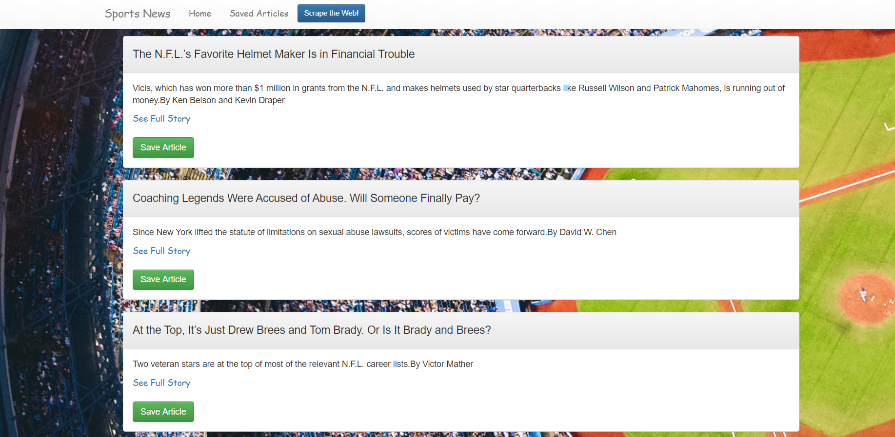
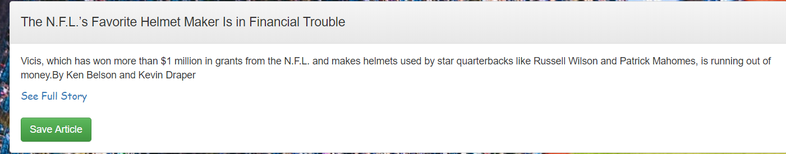
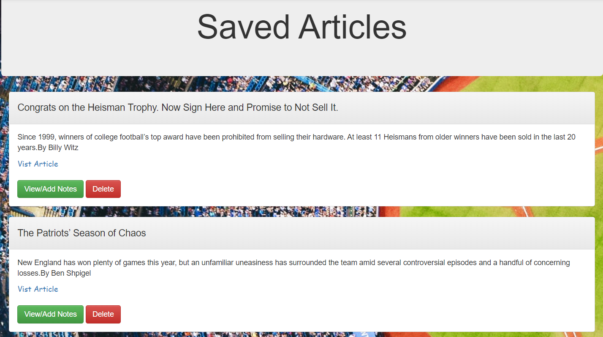

# WebScrape
Deployed Heroku link: (https://article-scraper2019.herokuapp.com/)

## How it works
 This application uses Cheerio to collect articles from the Sports Section of the New York Times. The articles are then stored in the Mongo Database as documents. Express allows the application to display the information that is in the database. Once displayed, the user can saved articles and add/delete comments that are associated with the given article.

<h1>Layout:</h1>
<ol>
<li><strong>User-Friendly Layout</strong></li>
<ul>
    <li>Easy to navigate</li>
    <li>Simple buttons</li>
    <li>Links for full articles</li>
</ul>

<li><strong>Front End</strong></li>
    <ul>
        <li>Stream-lined structure</li>
            <ol>
                <li>Clearly displays article titles, descriptions and save buttons</li>
            </ol>
    </ul>
<li><strong>Back End</strong></li>
    <ul>
        <li>Web Scraper</li>
        <ol>
            <li>Uses Cheerio to scrape sports articles from New York Times' sports section</li>
            <li>Stores scraped data to Mongoose database</li>
        </ol>
        <li>Axios</li>
        <ol>
            <li>Makes axios calls to the database for CRUD methods</li>
        </ol>
         <li>Express</li>
      <ol>
         <li>handles all of our http requests and responses</li>
         <li>backbone of our api and html routing</li>
      </ol>
    </ul>

 
 

<h1>Demo:</h1>

<ol>

<li>Most recent articles automatically display on the homepage</li>

   

<li>Click "See Full Strory" to go to the original article or click "Save Article" to save it to your personal article stash</li>

   

<li>On the Saved Article page, your personal stash can be viewed, notes can be added and you can delete specific articles</li>

## Technologies used

* MongoDb
* Mongoose
* Cheerio
* Express
* Handlebars
* Node